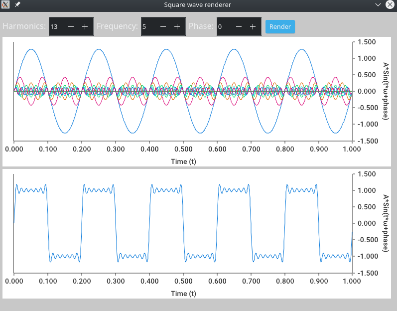

# Square wave fourier

Use fourier series to generate square waves.

Built using webview, some hacky javascript and Go.

## Build

Windows:

```golang
~$ go build -ldflags="-H windowsgui" -o ./out.exe ./...
```

Linux:

```golang
~$ go build -o ./out ./...
```

## Images

